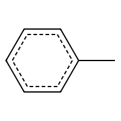

<div align="center">
  
  <h1>selfies-js</h1>
  <p>A pure JavaScript implementation of the SELFIES molecular string representation</p>
</div>

## What is SELFIES?

**SELFIES** (SELF-referencIng Embedded Strings) is a 100% robust molecular string representation. Unlike SMILES, every SELFIES string corresponds to a valid molecule, making it ideal for machine learning and generative models in chemistry.

This library is a JavaScript port inspired by the original Python implementation: **[aspuru-guzik-group/selfies](https://github.com/aspuru-guzik-group/selfies)**

> Krenn, M., Häse, F., Nigam, A., Friederich, P., & Aspuru-Guzik, A. (2020). Self-Referencing Embedded Strings (SELFIES): A 100% robust molecular string representation. *Machine Learning: Science and Technology*, 1(4), 045024.

## Overview

```javascript
import {
  decode, encode, isValid,
  getMolecularWeight, getFormula,
  lenSelfies, getSemanticConstraints,
  isChemicallyValid, getCanonicalSmiles, validateRoundtrip
} from 'selfies-js'

// SELFIES → SMILES
decode('[C][C][O]')  // 'CCO'

// SMILES → SELFIES
encode('CCO')  // '[C][C][O]'

// Syntax validation
isValid('[C][C][O]')  // true

// Chemistry validation (requires RDKit)
import { initRDKit } from 'selfies-js'
await initRDKit()
await isChemicallyValid('[C][C][O]')  // true - molecule is chemically valid
await getCanonicalSmiles('[C][C][O]')  // 'CCO' - canonical SMILES representation
await validateRoundtrip('CCO', '[C][C][O]')  // true - structure preserved

// Properties
getMolecularWeight('[C][C][O]')  // 46.07
getFormula('[C][C][O]')  // 'C2H6O'

// Utilities
lenSelfies('[C][C][O]')  // 3 (symbol count, not string length)

// Semantic constraints
const constraints = getSemanticConstraints()
console.log(constraints['C'])  // 4 (max bonds for carbon)

// SVG Rendering (using RDKit.js)
import { renderSelfies } from 'selfies-js'

const svg = await renderSelfies('[C][C][O]', {
  width: 300,
  height: 300
})
```

## Installation

```bash
npm install selfies-js
```

## Features

- **Core:** Decode SELFIES to SMILES
- **Core:** Encode SMILES to SELFIES
- **Validation:** Syntax and semantic validation
- **Chemistry Validation:** RDKit-based molecular validity checking
- **Canonical SMILES:** Structure comparison and roundtrip validation
- **Properties:** Molecular weight and formula calculation
- **Constraints:** Customizable semantic constraints (bonding rules)
- **Utilities:** Symbol counting, alphabet extraction
- **DSL:** Define and resolve molecule libraries with named definitions
- **Imports:** Modular .selfies files with import support
- **CLI:** Command-line interface for executing .selfies files
- **Rendering:** SVG visualization of molecular structures

## CLI Usage

The `selfies-js` CLI allows you to work with `.selfies` DSL files from the command line.

### Commands

```bash
# Execute a .selfies file and output resolved definitions
bun src/cli.js run molecules.selfies

# Output as SMILES instead of SELFIES
bun src/cli.js run molecules.selfies --format=smiles

# Validate a .selfies file for errors
bun src/cli.js validate molecules.selfies

# List all definitions in a file
bun src/cli.js list molecules.selfies

# Show help
bun src/cli.js help
```

### DSL Syntax

The `.selfies` DSL allows you to define named molecular fragments and compose them hierarchically:

```selfies
# Comments start with #

# Basic definitions
[methyl] = [C]
[ethyl] = [C][C]
[hydroxyl] = [O]

# Composition - reference other definitions
[ethanol] = [ethyl][hydroxyl]

# Complex structures with branches
[isopropyl] = [C][Branch1][C][C][C]
[isopropanol] = [isopropyl][hydroxyl]

# Aromatic rings
[phenyl] = [C][=C][C][=C][C][=C][Ring1][=Branch1]
[toluene] = [methyl][phenyl]
```

### Import Syntax

Import definitions from other `.selfies` files:

```selfies
# Import all definitions from another file
import "./fragments.selfies"

# Alternative syntax for importing all
import * from "./common.selfies"

# Import specific definitions only
import [methyl, ethyl, hydroxyl] from "./base.selfies"

# Use imported definitions
[my_molecule] = [methyl][hydroxyl]
```

Imports support:
- **Relative paths** resolved from the importing file's location
- **Chained imports** (file A imports B, B imports C)
- **Circular import detection** with clear error messages
- **Selective imports** to only include what you need

### Example Output

```bash
$ bun src/cli.js run molecules.selfies --format=smiles
methyl: C
ethyl: CC
hydroxyl: O
ethanol: CCO
isopropyl: C(C)C
isopropanol: C(C)CO
phenyl: C1=CC=CC=C1
toluene: CC1=CC=CC=C1
```

## DSL API

```javascript
import { parse, resolve, resolveAll } from 'selfies-js/dsl'
import { loadFile } from 'selfies-js/dsl'

// Load a file with imports
const program = loadFile('molecules.selfies')

// Or parse source directly
const source = `
[methyl] = [C]
[ethanol] = [methyl][C][O]
`
const program = parse(source)

// Resolve a single definition
resolve(program, 'ethanol')  // '[C][C][O]'

// Resolve with SMILES output
resolve(program, 'ethanol', { decode: true })  // 'CCO'

// Resolve all definitions
const all = resolveAll(program)
// Map { 'methyl' => '[C]', 'ethanol' => '[C][C][O]' }
```

## Visualization

The library uses **RDKit.js** for professional molecule rendering:

```javascript
import { renderSelfies, initRDKit } from 'selfies-js'

// Initialize RDKit (async, only needed once)
await initRDKit()

// Render toluene
const svg = await renderSelfies('[C][C][=C][C][=C][C][=C][Ring1][=Branch1]', {
  width: 300,
  height: 300
})
```

Features:
- Professional 2D coordinate generation via RDKit
- Proper skeletal formulas (carbons hidden)
- Correct benzene ring geometry
- Support for all bond types
- Stereochemistry notation
- Industry-standard rendering

## Examples

See the `examples/` directory for sample `.selfies` files:

- `base-fragments.selfies` - Reusable building blocks (alkyl groups, functional groups, halogens)
- `molecules-with-imports.selfies` - Demonstrates importing and composing molecules
- `organic-chemistry.selfies` - Alcohols, aldehydes, acids, amines, ethers
- `drug-fragments.selfies` - Pharmacophore fragments, drug-like building blocks
- `polymers.selfies` - Monomers, repeat units, oligomers

## Known Limitations

The encoder/decoder handles most common organic molecules correctly. Some complex cases have known limitations:

- **Bracket atoms** in SMILES (`[nH]`, `[C@@]`, `[13C]`) - limited support
- **Fused aromatic ring systems** - some complex cases may not roundtrip correctly
- **Polycyclic structures** with multiple ring closures - partial support

For complete SELFIES support, use the original Python library: [aspuru-guzik-group/selfies](https://github.com/aspuru-guzik-group/selfies)

## References

- **Original SELFIES Paper:** Krenn, M., Häse, F., Nigam, A., Friederich, P., & Aspuru-Guzik, A. (2020). Self-Referencing Embedded Strings (SELFIES): A 100% robust molecular string representation. *Machine Learning: Science and Technology*, 1(4), 045024. [DOI: 10.1088/2632-2153/aba947](https://doi.org/10.1088/2632-2153/aba947)

- **Python Implementation:** [github.com/aspuru-guzik-group/selfies](https://github.com/aspuru-guzik-group/selfies)

## License

MIT
