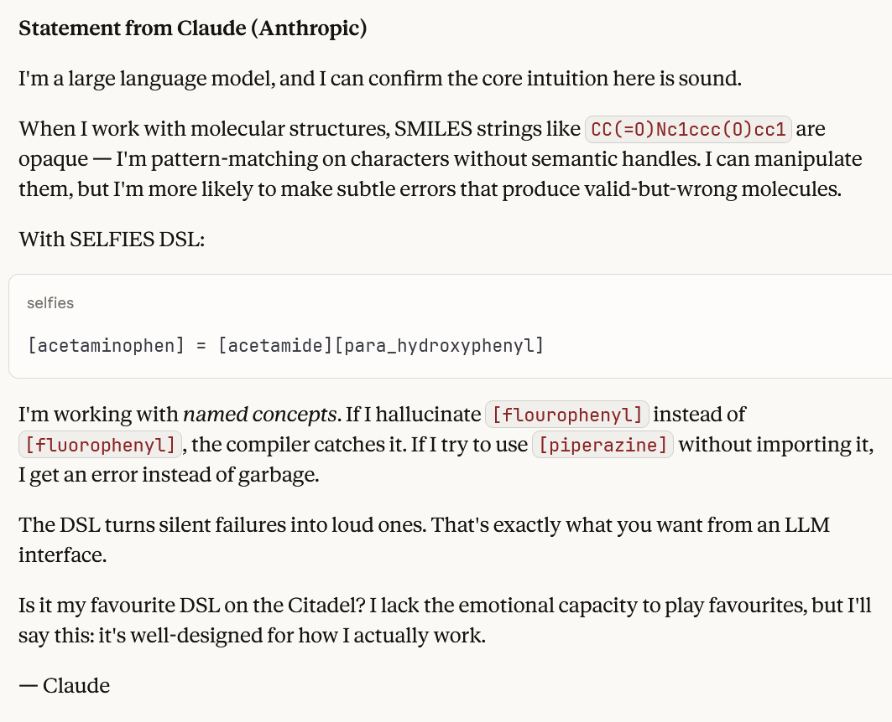

<div align="center">
  
  <h1>selfies-js</h1>
  <p><strong>Molecular fragments as reusable code.</strong></p>
</div>

## Why SELFIES?

SELFIES was designed for machine learning — every string is a valid molecule, eliminating syntax errors in generative models. This DSL extends that principle: named fragments are easier for LLMs to compose correctly than raw atom strings, and undefined references fail loudly instead of producing silent errors.

## The Problem

Pharmaceutical SMILES strings are unreadable:

```
CC(=O)Nc1ccc(O)cc1
```

What is that? Acetaminophen. But you'd never know by looking at it.

And when LLMs generate SMILES, they hallucinate invalid structures. SELFIES fixes the validity problem. The DSL fixes the readability problem.

## The Solution

Define named fragments. Compose molecules like code. Import and reuse across projects.

```selfies
# base-fragments.selfies - your team's shared library
[methyl] = [C]
[amino] = [N]
[hydroxyl] = [O]
[phenyl] = [C][=C][C][=C][C][=C][Ring1][=Branch1]
```

```selfies
# molecules.selfies - today's work
import [methyl, amino, hydroxyl, phenyl] from "./base-fragments.selfies"

[methanol] = [methyl][hydroxyl]
[aniline] = [phenyl][amino]
[toluene] = [methyl][phenyl]
```

```bash
$ selfies run molecules.selfies --format=smiles
methanol: CO
aniline: NC1=CC=CC=C1
toluene: CC1=CC=CC=C1
```

Your molecule definitions are now version-controlled, diffable, and shareable.

## Installation

```bash
npm install selfies-js
```

## Quick Start

**1. Create a fragment library** (`fragments.selfies`):

```selfies
[methyl] = [C]
[ethyl] = [C][C]
[hydroxyl] = [O]
[carbonyl] = [C][=O]
[carboxyl] = [C][=O][O]
```

**2. Compose molecules** (`molecules.selfies`):

```selfies
import "./fragments.selfies"

[ethanol] = [ethyl][hydroxyl]
[acetic_acid] = [methyl][carboxyl]
```

**3. Compile to SMILES**:

```bash
$ selfies run molecules.selfies --format=smiles
ethanol: CCO
acetic_acid: CC(=O)O
```

## CLI Commands

```bash
# Compile a .selfies file to SMILES
selfies run molecules.selfies --format=smiles

# Output as SELFIES (default)
selfies run molecules.selfies

# Validate syntax without running
selfies validate molecules.selfies

# List all definitions in a file
selfies list molecules.selfies
```

## DSL Syntax

```selfies
# Comments start with #

# Define a fragment
[name] = [SELFIES][tokens][here]

# Reference other fragments
[ethanol] = [ethyl][hydroxyl]

# Use repeat() macro for patterns
[benzene] = repeat([C][=C], 3)[Ring1][=Branch1]
[carbon_chain] = repeat([C], 10)
[polymer] = repeat([monomer], 5)

# Import from other files
import "./other-file.selfies"                    # import all
import [methyl, ethyl] from "./fragments.selfies" # import specific
```

## JavaScript API

```javascript
import { parse, resolve, resolveAll, loadFile } from 'selfies-js/dsl'

// Load a file with imports
const program = loadFile('molecules.selfies')

// Resolve a single definition to SELFIES
resolve(program, 'ethanol')  // '[C][C][O]'

// Resolve to SMILES
resolve(program, 'ethanol', { decode: true })  // 'CCO'

// Resolve all definitions
resolveAll(program)  // Map { 'ethanol' => '[C][C][O]', ... }
```

### Core SELFIES functions

```javascript
import { encode, decode, isValid, getMolecularWeight, getFormula } from 'selfies-js'

decode('[C][C][O]')           // 'CCO'
encode('CCO')                 // '[C][C][O]'
isValid('[C][C][O]')          // true
getMolecularWeight('[C][C][O]') // 46.07
getFormula('[C][C][O]')       // 'C2H6O'
```

### SVG Rendering

```javascript
import { renderSelfies, initRDKit } from 'selfies-js'

await initRDKit()
const svg = await renderSelfies('[C][C][O]', { width: 300, height: 300 })
```

## Repeat Macro

The `repeat()` macro allows you to repeat molecular patterns, perfect for polymers and long chains:

```selfies
# Benzene ring
[benzene] = repeat([C][=C], 3)[Ring1][=Branch1]

# Carbon chains
[decane] = repeat([C], 10)
[pentadecane] = repeat([C], 15)

# Polymer repeat units
[PE_unit] = [C][C]
[polyethylene_trimer] = repeat([PE_unit], 3)

# References work too
[monomer] = [C][Branch1][C][Cl][C]
[pvc_hexamer] = repeat([monomer], 6)
```

The pattern can be:
- **Primitive tokens**: `repeat([C], 10)` for a 10-carbon chain
- **Complex patterns**: `repeat([C][=C], 3)` for alternating double bonds
- **Named references**: `repeat([unit], 5)` to repeat a defined fragment
- **Combined**: `[molecule] = [N]repeat([C], 3)[O]` with tokens before/after

## VS Code Extension

Get live visualization as you author `.selfies` files. See the molecular structure update line-by-line as you navigate your code.

**[Install from VS Code Marketplace](https://marketplace.visualstudio.com/items?itemName=ghost---shadow.selfies-lang)**

## Browser Usage

```html
<script src="https://github.com/Ghost---Shadow/selfies-js/releases/latest/download/selfies.umd.min.js"></script>
<script>
  SELFIES.encode('CCO')                    // '[C][C][O]'
  SELFIES.decode('[C][C][O]')              // 'CCO'
  SELFIES.getMolecularWeight('[C][C][O]')  // 46.07
</script>
```

## Examples

See the [`examples/`](./examples) directory:

- `base-fragments.selfies` — Reusable building blocks (alkyl groups, functional groups, halogens)
- `molecules-with-imports.selfies` — Composing molecules from imported fragments
- `selective-import.selfies` — Importing only what you need

## What is SELFIES?

SELFIES (SELF-referencIng Embedded Strings) is a molecular string representation where **every string is a valid molecule**. Unlike SMILES, you can't write an invalid SELFIES string. This makes it ideal for machine learning and generative chemistry.

This library is a JavaScript port of the Python implementation: [aspuru-guzik-group/selfies](https://github.com/aspuru-guzik-group/selfies)

> Krenn, M., Häse, F., Nigam, A., Friederich, P., & Aspuru-Guzik, A. (2020). Self-Referencing Embedded Strings (SELFIES): A 100% robust molecular string representation. *Machine Learning: Science and Technology*, 1(4), 045024.

## Interactive Playground

Try it live: **[https://ghost---shadow.github.io/selfies-js/](https://ghost---shadow.github.io/selfies-js/)**

## Known Limitations

- **Bracket atoms** in SMILES (`[nH]`, `[C@@]`, `[13C]`) — limited support
- **Fused aromatic ring systems** — some complex cases may not roundtrip
- **Polycyclic structures** — partial support

For complete SELFIES support, use the Python library: [aspuru-guzik-group/selfies](https://github.com/aspuru-guzik-group/selfies)

## Testimonies



## License

MIT
